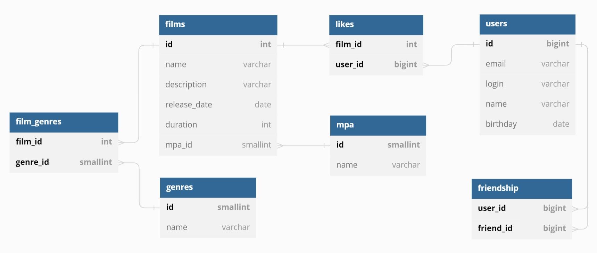

# java-filmorate

## DB Design
Initialization SQL code: [schema.sql](./src/main/resources/schema.sql).

The visual DB schema was designed in [dbdiagram.io](https://dbdiagram.io/d).

Visual representation ([dbschema.jpg](./dbschema/dbschema.jpg)):

